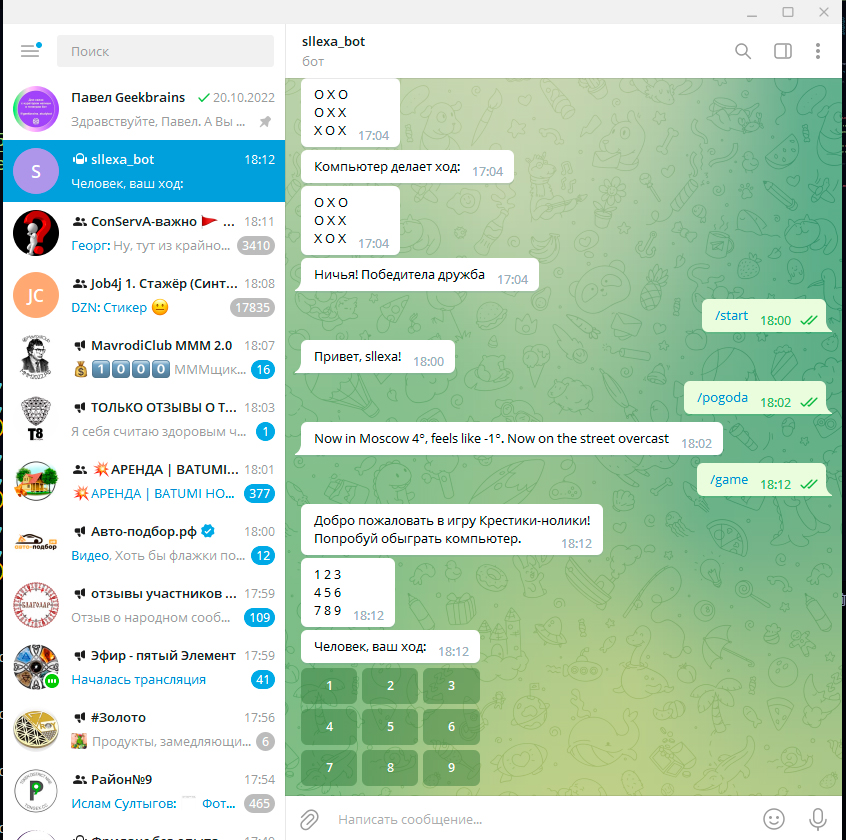

# Telegram bot

## Задача

Прикрутить бота к задачам с предыдущего семинара: 
к игре "Крестики-нолики"

## Команды бота

/start - команда, которая запускает бота. Бот выводит сообщение с приветствием.
/game - команда запускает игру "Крестики-нолики". Человек играет против компьтера.
/pogoda - команда выводит погоду через API от ЯндексПогоды. Выводятся данные по Москве, но можно изменить запрос для любого другого города.

## Скрины

Скрины всех модулей находятся в папке *img*

## Работа бота

